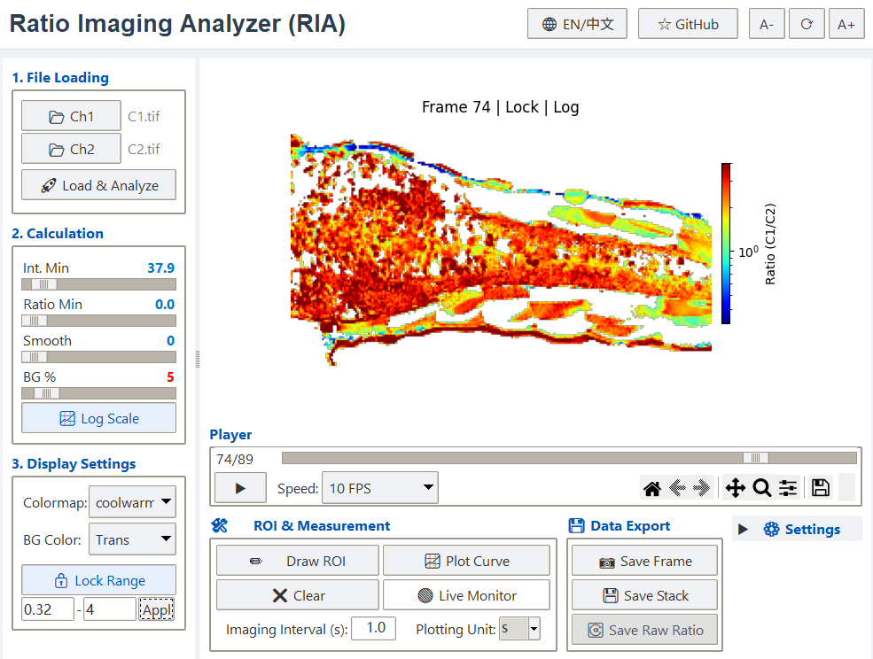
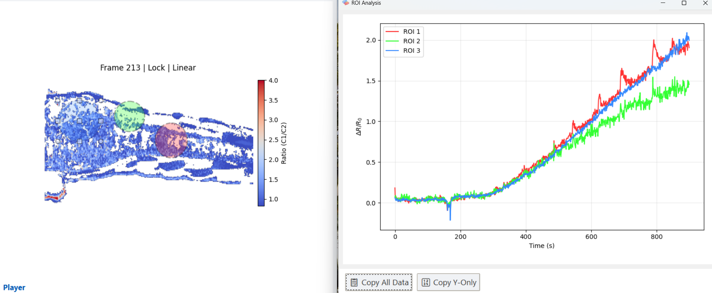

# Summary

Ratiometric fluorescence imaging stands as a cornerstone technique in modern quantitative biology. By measuring the ratio of fluorescence intensities at two distinct wavelengths, this method renders measurements independent of sensor concentration, optical path length, and uneven illumination, making it the "gold standard" for quantifying dynamic intracellular events [@Tao:2023]. Its application spans from monitoring ion dynamics (e.g., Calcium, pH) to tracking essential metabolites (e.g., tryptophan, ATP) using an expanding toolkit of genetically encoded biosensors.

**Ratio Imaging Analyzer (RIA)** is a lightweight, open-source desktop application designed to streamline the processing of such ratiometric data. Unlike complex image processing libraries that require scripting skills, RIA bridges the gap between raw data and biological insight through a user-friendly Graphical User Interface (GUI). It empowers researchers to perform dynamic background subtraction, intelligent thresholding, and real-time Region of Interest (ROI) analysis on standard personal computers, facilitating rapid hypothesis testing and data exploration.

# Statement of Need

Despite the widespread adoption of ratiometric sensors, quantitative analysis of time-lapse data remains a bottleneck. A significant practical challenge is the "portability" of data analysis. Commercial software packages (e.g., MetaFluor, NIS-Elements) are powerful but are typically tied to image acquisition workstations via hardware dongles or restrictive licenses. This forces researchers to perform analysis in the microscope room, limiting flexibility and efficiency.

Furthermore, open-source alternatives like ImageJ/Fiji [@Schindelin:2012], while versatile, often require complex, multi-step manual workflows for ratiometric stacks (e.g., channel splitting, background subtraction, calculator operations) or rely on legacy plugins that may not be optimized for modern large datasets. Custom Python or MATLAB scripts offer flexibility but lack accessibility for wet-lab biologists without programming expertise.

**RIA** addresses these critical needs by providing a dedicated, standalone executable that:

1.  **Decouples Acquisition from Analysis**: Researchers can process data on their personal laptops (Windows) without installing Python environments or purchasing licenses, enabling analysis outside the laboratory.
2.  **Standardizes Workflow**: It encapsulates the mathematical rigor of ratiometric calculation $R = (Ch1 - Bg1) / (Ch2 - Bg2)$ into an automated, "drag-and-drop" interface, ensuring reproducibility.
3.  **Enhances Efficiency**: Utilizing vectorized operations from `NumPy` [@Harris:2020], RIA processes large multi-page TIFF stacks instantly, providing real-time feedback that is essential for screening large libraries of sensor variants.

# Implementation

RIA is developed in Python 3, utilizing `tkinter` for a native, dependency-minimal Graphical User Interface (GUI). The software architecture separates the UI logic from the core processing engine to ensure responsiveness.

Key technical features include:

* **Vectorized Processing**: The core ratiometric calculation is implemented using `NumPy` array operations, optimized for performance on standard CPUs.
* **NaN-safe Spatial Smoothing**: To preserve morphological details during noise reduction, RIA implements a custom normalized convolution algorithm (adapted from `scipy.ndimage` [@Virtanen:2020]). This method handles `NaN` values (masked background) correctly, preventing the erosion of data at cellular edges common in standard Gaussian filtering.
* **Interactive Visualization**: The plotting engine, powered by `Matplotlib` [@Hunter:2007], features a threaded observer pattern. This allows users to draw and drag ROIs on the video stream with instant updates to the time-course trace, facilitating rapid identification of physiological events.
* **Data Integrity**: RIA supports exporting the raw `float32` ratio stack, ensuring that downstream statistical analysis is based on unaltered calculation results.

# Acknowledgements

We acknowledge the open-source community for maintaining the foundational libraries that make this tool possible.

# References