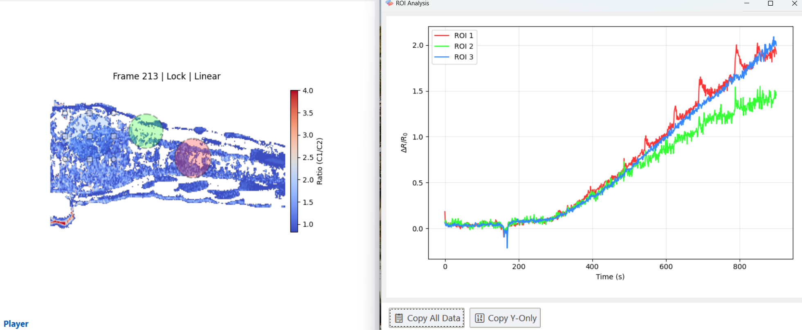

# Summary

Ratiometric fluorescence imaging stands as a cornerstone technique in modern quantitative biology. By measuring the ratio of fluorescence intensities at two distinct wavelengths, this method renders measurements independent of sensor concentration, optical path length, and uneven illumination, making it the "gold standard" for quantifying dynamic intracellular events [@Tao:2023]. Its application spans from monitoring ion dynamics (e.g., Calcium, pH) to tracking essential metabolites (e.g., Tryptophan, ATP) using an expanding toolkit of genetically encoded biosensors.

**Ratio Imaging Analyzer (RIA)** is a lightweight, open-source desktop application designed to streamline the processing of such ratiometric imaging data. Unlike complex image processing libraries that require scripting skills, RIA bridges the gap between raw data and biological insight through a user-friendly Graphical User Interface (GUI). It empowers researchers to perform motion correction, dynamic background subtraction, interactive thresholding, and real-time Region of Interest (ROI) analysis on standard personal computers, facilitating rapid hypothesis testing and data exploration.

{width=60%}

# Statement of Need

Despite the widespread adoption of ratiometric sensors, quantitative analysis of time-lapse data remains a bottleneck. A significant gap exists for user-friendly tools tailored to "wet-lab" experimental biologists who lack programming expertise.

While commercial software packages (e.g., MetaFluor, NIS-Elements) are powerful, they are often tied to acquisition workstations via hardware dongles, limiting accessibility. Conversely, open-source alternatives have struggled to provide a modern, integrated experience. For instance, legacy ImageJ plugins like *Ratio Plus* [@Magalhaes:2004] are largely deprecated and difficult to access. Critically, these older tools often lack essential dynamic features required for modern analysis, such as adjustable Look-Up Tables (LUTs), real-time background subtraction, and motion correction.

**RIA** addresses these challenges by offering a lightweight, **"all-in-one"** standalone executable. It streamlines the entire workflow—from loading raw imaging stacks to generating publication-quality ratiometric figures or movies—without requiring complex plugin installations or script assembly. Specifically, RIA:

1.  **Eliminates Technical Barriers**: Researchers can process data on standard personal laptops (Windows) without setting up Python environments.
2.  **Integrates Essential Tools**: Unlike piecemeal solutions, RIA bundles motion correction (ECC), interactive thresholding, tunable visualization, and real-time ROI plotting into a single interface.
3.  **Enhances Efficiency**: Utilizing vectorized operations from `NumPy` [@Harris:2020] and the C++ backend of `OpenCV` [@Bradski:2000], RIA processes large datasets instantly, ensuring smooth operation and enabling rapid hypothesis testing.

# State of the field

The landscape of ratiometric analysis software is currently bifurcated between highly flexible but complex open-source platforms and expensive, proprietary commercial packages.

On one end of the spectrum, generalist image analysis platforms like **ImageJ/Fiji** [@Schindelin:2012] offer immense power through plugins. However, performing ratiometric analysis in ImageJ often requires a multi-step manual workflow (splitting channels, background subtraction, thresholding, and image division) or the creation of custom macros. While plugins like *Ratio Plus* [@Magalhaes:2004] exist, they often lack integrated motion correction or interactive time-lapse plotting, forcing users to switch between disparate tools. Newer Python-based ecosystems like **napari** [@Sofroniew:2022] offer modern, multidimensional viewing but typically require users to manage Python environments and dependencies, presenting a significant barrier to entry for non-computational biologists.

On the other end, commercial acquisition software provides robust, integrated analysis workflows. However, these solutions are frequently restricted by expensive licensing models and hardware dongles, confining data analysis to the image acquisition workstation. This creates a bottleneck where data cannot be easily analyzed on personal laptops or off-site.

**RIA** occupies a distinct niche between these two extremes. It provides the specific, streamlined workflow of commercial ratiometric tools—including essential features like drift correction and real-time plotting—packaged in a lightweight, open-source executable that requires zero setup. This design effectively decouples analysis from acquisition, offering a "plug-and-play" solution for ratiometric data.

# Software Design

RIA is developed in Python 3, utilizing `tkinter` for a native, dependency-minimal Graphical User Interface (GUI). The software architecture separates the UI logic from the core processing engine to ensure responsiveness. Recent updates have focused on minimizing the software footprint (~60 MB) and maximizing processing speed.

{width=80%}

Key technical features include:

* **High-Performance Image Processing**: To achieve real-time performance on consumer-grade CPUs, RIA leverages `OpenCV-headless` [@Bradski:2000]. This replaces heavier dependencies like `SciPy`, significantly reducing application size and startup time.
* **Motion Correction**: RIA integrates the Enhanced Correlation Coefficient (ECC) algorithm, offering both high speed and correction accuracy to automatically align image stacks and compensate for sample drift during long-term imaging sessions. Importantly, we validated this approach using real *in vivo* imaging datasets (e.g., zebrafish larvae), demonstrating its robustness and reliability under practical experimental conditions.
* **Normalized Convolution for Smoothing**: Standard Gaussian blurring can introduce artifacts at image boundaries containing `NaN` values (masked background). RIA implements a custom **Normalized Convolution** algorithm using OpenCV primitives. This approach computes the weighted average of valid pixels only, preventing the propagation of `NaN` values and preserving data integrity at cellular edges.
* **Interactive Visualization**: The plotting engine, powered by `Matplotlib` [@Hunter:2007], features a threaded observer pattern. This allows users to draw and drag ROIs on the video stream with instant updates to the time-course trace, facilitating rapid identification of physiological events.
* **Memory Optimization**: Large TIFF stacks are handled using memory-efficient IO strategies, maintaining data in `uint16` format until calculation to minimize RAM usage.

# Research Impact Statement

**RIA** is designed to accelerate quantitative biology research by democratizing access to robust image analysis tools. Its primary impact lies in lowering the technical barrier for "wet-lab" biologists, enabling them to process complex time-lapse datasets without requiring programming literacy or expensive software licenses.

By facilitating the analysis of ratiometric biosensors—which are critical for monitoring intracellular Ca²⁺, pH, ATP, and other metabolites—RIA supports a wide range of physiological studies. A key contribution of the software is its integration of the ECC motion correction algorithm. In live imaging scenarios, such as calcium imaging in zebrafish larvae or awake mice, sample movement often corrupts ratiometric signals. RIA allows researchers to rescue these datasets through automated alignment, significantly reducing data wastage and improving the reproducibility of *in vivo* experiments.

Furthermore, RIA promotes open science and reproducibility. By providing a standardized, verifiable pipeline for background subtraction and calculation, it offers an alternative to ad-hoc, manual processing methods that are prone to human error. The software’s portability also supports educational contexts, allowing students to learn quantitative imaging concepts on their own devices without institutional software constraints.

# AI usage disclosure

This paper was drafted with the assistance of Large Language Models (LLMs) for grammatical refinement and structural organization. The core software logic, code implementation, and scientific validation were performed entirely by the human authors. All AI-generated text was reviewed and verified for accuracy by the authors.

# Acknowledgements

We acknowledge the open-source community for maintaining the foundational libraries that make this tool possible, specifically NumPy, Matplotlib, and OpenCV.

# References